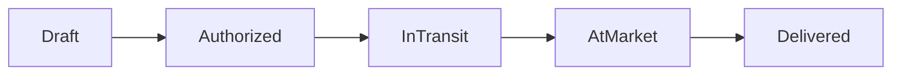

# 🍃 CocaTrace - Trazabilidad de Hoja de Coca

   

**Desarrollado por el equipo CWAL para Buildathon 2025**

## 📋 Descripción

CocaTrace es un sistema de trazabilidad blockchain para la cadena de suministro de hoja de coca en Bolivia. Utiliza NFTs (ERC721) para crear un registro inmutable y transparente desde la producción hasta la venta final, cumpliendo con las regulaciones bolivianas.

### 🎯 Problema que Resuelve

- **Falta de trazabilidad** en la cadena de suministro de coca
- **Dificultad para verificar** el origen legal de los lotes
- **Procesos manuales** propensos a errores y fraude
- **Cumplimiento regulatorio** complejo con FELCN y autoridades

### ✨ Características Principales

- 🏷️ **Registro de Productores** con tarjetas Yungas y Detalle
- 📦 **Tokenización de Lotes** como NFTs únicos
- 🔐 **Sistema de Validadores** multicapa (Yungas, FELCN, Mercado)
- 📍 **Seguimiento de Estados** en tiempo real
- 🛡️ **Inmutabilidad** y transparencia blockchain
- ⚡ **Gas Eficiente** en Avalanche

## 🚀 Despliegue

### Red de Prueba
- **Blockchain**: Avalanche Fuji Testnet
- **Dirección del Contrato**: [`0x801e3d0B1305Ae803c5d5C142fbFc57ADb650827`](https://testnet.snowtrace.io/address/0x801e3d0B1305Ae803c5d5C142fbFc57ADb650827)
- **Explorador**: [SnowTrace Testnet](https://testnet.snowtrace.io/)

## 🏗️ Arquitectura del Sistema

### Actores del Sistema

1. **👨‍🌾 Productores**
   - Registran su tarjeta (Yungas/Detalle)
   - Crean lotes de coca
   - Mueven lotes autorizados

2. **👮‍♂️ Validador Yungas**
   - Autoriza lotes para transporte
   - Verifica destinos según tipo de tarjeta

3. **🏪 Validador de Mercado**
   - Confirma llegada al mercado
   - Verifica condiciones de venta

4. **🛡️ Validador FELCN**
   - Inspección final
   - Autoriza transferencia al comprador

### Estados del Lote



## 🛠️ Tecnologías Utilizadas

- **Blockchain**: Avalanche C-Chain
- **Smart Contracts**: Solidity ^0.8.20
- **Framework**: Foundry (Forge)
- **Estándares**: ERC721 (NFTs), OpenZeppelin
- **Testing**: Forge Test Suite

## 📦 Instalación y Configuración

### Prerrequisitos

```bash
# Instalar Foundry
curl -L https://foundry.paradigm.xyz | bash
foundryup

# Verificar instalación
forge --version
```

### Clonar y Configurar

```bash
# Clonar repositorio
git clone <repository-url>
cd cocatrace-smart-contract

# Instalar dependencias
forge install

# Compilar contratos
forge build
```

### Variables de Entorno

```bash
# Crear archivo .env
cp .env.example .env

# Configurar variables
PRIVATE_KEY=your_private_key_here
AVALANCHE_FUJI_RPC=https://api.avax-test.network/ext/bc/C/rpc
```

## 🧪 Testing

### Ejecutar Tests

```bash
# Ejecutar todos los tests
forge test

# Tests con verbosidad
forge test -vvv

# Test específico
forge test --match-test testCompleteWorkflow -vvv

# Coverage
forge coverage
```

### Tests Incluidos

- ✅ Registro de tarjetas de productor
- ✅ Creación y validación de lotes
- ✅ Flujo completo de autorización
- ✅ Gestión de validadores
- ✅ Transferencias de NFTs
- ✅ Casos edge y errores

## 🚀 Despliegue

### Testnet (Avalanche Fuji)

```bash
# Cargar variables de entorno
source .env

# Desplegar
forge script script/CocaTrace.s.sol \
    --rpc-url $AVALANCHE_FUJI_RPC \
    --broadcast \
    --verify
```

### Mainnet (Avalanche C-Chain)

```bash
# Configurar RPC de mainnet
AVALANCHE_MAINNET_RPC=https://api.avax.network/ext/bc/C/rpc

# Desplegar (¡CUIDADO! Usar fondos reales)
forge script script/CocaTrace.s.sol \
    --rpc-url $AVALANCHE_MAINNET_RPC \
    --broadcast \
    --verify
```

## 📚 Guía de Uso

### 1. Registro de Productor

```solidity
// Tarjeta Yungas (sin restricción de destino)
cocaTrace.registerProducerCard(CardType.Yungas, "");

// Tarjeta Detalle (con restricción de departamento)
cocaTrace.registerProducerCard(CardType.Detalle, "La Paz");
```

### 2. Crear Lote

```solidity
cocaTrace.createBatch(
    "PROD001",           // ID del productor
    "Yungas Region",     // Ubicación de cosecha
    15                   // Cantidad de taques (1-20)
);
```

### 3. Autorizar Lote

```solidity
// Solo validador Yungas
cocaTrace.authorizeBatch(tokenId, "La Paz");
```

### 4. Flujo Completo

```solidity
// 1. Mover lote (solo productor)
cocaTrace.moveBatch(tokenId);

// 2. Check de mercado (solo validador de mercado)
cocaTrace.marketCheck(tokenId);

// 3. Check FELCN y transferencia final
cocaTrace.felcnCheck(tokenId, buyerAddress);
```

## 🔧 API de Contratos

### Funciones Principales

| Función | Descripción | Permisos |
|---------|-------------|----------|
| `registerProducerCard()` | Registra tarjeta de productor | Cualquiera |
| `createBatch()` | Crea nuevo lote | Productor registrado |
| `authorizeBatch()` | Autoriza transporte | Validador Yungas |
| `moveBatch()` | Inicia transporte | Propietario NFT |
| `marketCheck()` | Confirma llegada | Validador Mercado |
| `felcnCheck()` | Inspección final | Validador FELCN |

### Eventos

```solidity
event BatchCreated(uint256 indexed tokenId, address indexed producer, uint256 taquesCount);
event BatchAuthorized(uint256 indexed tokenId, address indexed validator, string destination);
event BatchTransferred(uint256 indexed tokenId, address indexed from, address indexed to, BatchStatus newStatus);
```

## 🔒 Seguridad

### Auditorías
- ✅ Tests unitarios completos (>95% coverage)
- ✅ Uso de OpenZeppelin (contratos auditados)
- ✅ Validaciones de permisos
- ✅ Checks de estado

### Consideraciones
- 🔐 Solo owner puede gestionar validadores
- 🛡️ Validaciones estrictas en cada estado
- ⚡ Reentrancy protection via OpenZeppelin
- 🔍 Eventos completos para auditabilidad

## 📊 Métricas del Contrato

```bash
# Tamaño del contrato
forge build --sizes

# Gas estimation
forge test --gas-report
```

## 🤝 Contribución

### Proceso de Desarrollo

1. Fork del repositorio
2. Crear rama feature (`git checkout -b feature/nueva-funcionalidad`)
3. Commits con mensajes descriptivos
4. Tests para nueva funcionalidad
5. Pull request con descripción detallada

### Estándares de Código

- Solidity Style Guide
- Documentación completa en NatSpec
- Tests unitarios obligatorios
- Gas optimization

## 📄 Licencia

Este proyecto está bajo la Licencia MIT. Ver [LICENSE](LICENSE) para más detalles.

## 👥 Equipo CWAL

Desarrollado con ❤️ para Buildathon 2025

- **Blockchain Development**: Smart contracts y arquitectura
- **Testing**: Suite completa de pruebas
- **Documentation**: Documentación técnica y usuario

## 🔗 Enlaces Útiles

- [Contrato en SnowTrace](https://testnet.snowtrace.io/address/0x801e3d0B1305Ae803c5d5C142fbFc57ADb650827)
- [Avalanche Documentation](https://docs.avax.network/)
- [Foundry Book](https://book.getfoundry.sh/)
- [OpenZeppelin Contracts](https://docs.openzeppelin.com/contracts/)

## 📞 Soporte

Para preguntas técnicas o soporte:
- Crear issue en GitHub
- Contactar al equipo CWAL
- Documentación técnica en `/docs`

---

**¿Encontraste un bug? ¿Tienes una sugerencia?** ¡Abre un issue y ayúdanos a mejorar CocaTrace! 🚀